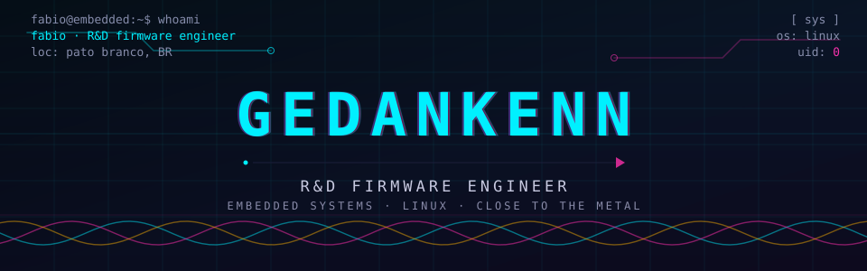

<div align="center">
  
</div>

<p align="center">
  
</p>

<p align="center">
  <a href="mailto:fabioslikastella@gmail.com"></a>
  <a href="https://www.linkedin.com/in/fabio-slika-stella-6a37b513a/"></a>
  <a href="https://x.com/Th00rBeardedOne"></a>
  <a href="https://github.com/Gedankenn"></a>
</p>

---

## ⚡ whoami

Computer Engineer working on **R&D embedded systems** at **ControlID** — firmware for agricultural machinery, focused on sensing, automation and real-time control.

I build low-level software where **physics, electrons and code collide**: system bring-up, drivers, bootloaders, control loops. At home with oscilloscopes, logic analyzers, datasheets and a Linux terminal.

```bash
$ whoami
fabio — R&D firmware engineer
$ echo "stack"
close_to_the_metal()
```

## 🎯 R&D Focus

```
▸ firmware architecture & system bring-up
▸ bare-metal & RTOS development
▸ drivers, HALs, BSPs, bootloaders & OTA
▸ hardware bring-up & board validation
▸ real-time control & sensor integration
▸ field protocols — CAN/J1939, RS485, I²C, SPI, UART
▸ embedded networking & IPv6
▸ linux-based development & automation
```

## 🛠 Toolchain

**Languages**


**MCUs**


**Interfaces**


**Tooling**


## 📊 System Stats

<p align="center">
  
</p>

<p align="center">
  
</p>

## 🚀 Featured R&D Projects

| Project | What it is | |
|---|---|---|
| [**ESP32-FOC**](https://github.com/Gedankenn/ESP32-FOC) | Field-Oriented Control of BLDC motors on ESP32 | ★ 10 |
| [**OTPC**](https://github.com/Gedankenn/OTPC) | Open Traction PMSM Controller | new |
| [**power_profiller**](https://github.com/Gedankenn/power_profiller) | Real-time energy profiling — ESP32 + INA226 | ★ 4 |
| [**mysocket**](https://github.com/Gedankenn/mysocket) | Own socket wrapper in C | ★ 4 |
| [**file_transfer_python**](https://github.com/Gedankenn/file_transfer_python) | File transfer over IPv6 | ★ 3 |
| [**stocks**](https://github.com/Gedankenn/stocks) | Terminal stock portfolio | ★ 3 |
| [**3-phase-inverter**](https://github.com/Gedankenn/3-phase-inverter) | 3-phase inverter module study | WIP |
| [**esp32_bootloader**](https://github.com/Gedankenn/esp32_bootloader) | Custom ESP32 bootloader / OTA | WIP |

**More:** [esp32_drivers](https://github.com/Gedankenn/esp32_drivers) · [esp32_wattimeter](https://github.com/Gedankenn/esp32_wattimeter) · [simulador-b3](https://github.com/Gedankenn/simulador-b3) · [Kalman BLDC sim](https://github.com/Gedankenn/Python-Simulation-of-BLDC-motor-using-Kalman-Filter) · [FileTransfer](https://github.com/Gedankenn/FileTransfer)

## 🧬 Philosophy

```
▸ understand the system before optimizing it
▸ measure before guessing
▸ read the datasheet
▸ respect physics
▸ automate everything repeatable
▸ keep firmware boring and reliable
```

## 📬 Connect

- 📧 **Email:** fabioslikastella@gmail.com
- 💼 **LinkedIn:** [fabio-slika-stella](https://www.linkedin.com/in/fabio-slika-stella-6a37b513a/)
- 🐦 **X/Twitter:** [@Th00rBeardedOne](https://x.com/Th00rBeardedOne)
- 🖥️ **GitHub:** [Gedankenn](https://github.com/Gedankenn)

---

<p align="center">
  <sub><b>© 2026 Fabio S. Stella</b> — R&D Firmware Engineer · Close to the metal ⚙️ fueled by coffee ☕</sub>
</p>
